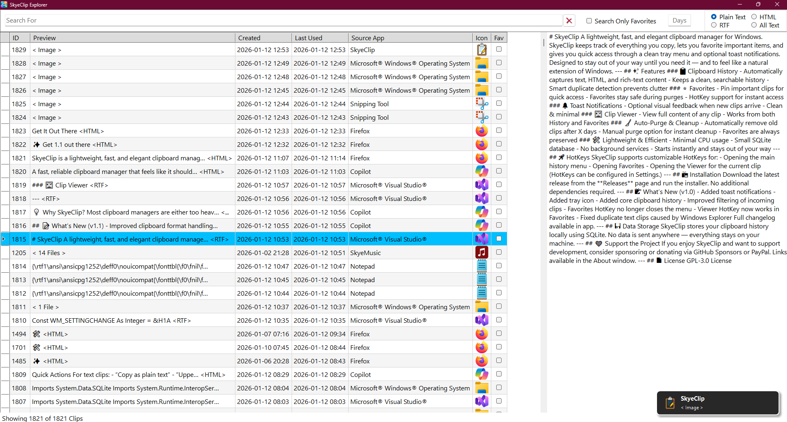

# SkyeClip
A lightweight, fast, and elegant clipboard manager for Windows.

---

## ⚡ Quick Overview
SkyeClip is a modern clipboard manager for Windows that captures everything you copy, 
keeps your history organized, and gives you fast access through a clean tray menu, 
Clip Explorer, and customizable HotKeys.

---

## ✨ Features

### 📋 Clipboard History
- Automatically captures text, HTML, and rich-text content  
- Keeps a clean, searchable history  
- Smart duplicate detection prevents clutter  

### ⭐ Favorites
- Pin important clips for quick access  
- Favorites stay safe during purges  
- HotKey support for instant access  

### 🔔 Toast Notifications
- Optional visual feedback when new clips arrive  
- Clean & minimal 

### 🖼️ Clip Viewer
- View full content of any clip  
- Works from both History and Favorites  

### 🖼️ Scratch Pad
- Temporary space to store clips you’re working with, or even add clips together
- Edit the text directly in the Scratch Pad
- Cut, copy, and paste plain text between the Scratch Pad and other apps

### 🔍 Clip Explorer
- Browse and search your entire clipboard history in a dedicated window
- Filter by type: Text, RTF, or HTML
- Sort by text, date, favorites, or last used date

### 🧹 Auto‑Purge & Cleanup
- Automatically remove old clips after X days  
- Manual purge option for instant cleanup  
- Favorites are always preserved

### ⚙️ Automatic Backups
- Regular backups of clipboard history
- Manual option
- Flexible schedule
- Auto‑purge of old backups
- Restore support

### ⚙️ Customizable Settings

### 🚀 HotKeys
SkyeClip supports customizable HotKeys for:

- Favorites / Unfavorite the current clip
- Opening the Viewer for the current clip
- Opening the Scratch Pad and pasting the current clip into it

(HotKeys can be configured in Settings.)

### 🛠️ Lightweight & Efficient
- Minimal CPU usage  
- Small SQLite database  
- No background services  
- Starts instantly and stays out of your way  

---

## 💡 Why SkyeClip?
Most clipboard managers are either too heavy, too limited, or too intrusive.
SkyeClip focuses on:
- Fidelity — preserves original clipboard formats
- Speed — instant capture and restore
- Simplicity — no clutter, no bloat
- Reliability — predictable behavior, clean UI

---

## 🖥️ System Requirements
- Windows 10 or later
- .NET 10.0 Runtime

---

## 📦 Installation
Download the latest release from the **Releases** page and run the installer.  
No additional dependencies required.

---

## 📝 What’s New (v1.2)
- Backup System
- Better filedrop previews
- Image Previews in Clip Explorer
- Export Clip
- Cleaner unified previews for text, HTML, and RTF
- Better stability when capturing images and file drops
- Update/Version Checker
- Clip Explorer improvements
- More Themes

Full changelog available in app.

---

## 💾 Data Storage
SkyeClip stores your clipboard history locally using SQLite.  
No data is sent anywhere — everything stays on your machine.

---

## ❤️ Support the Project
If you enjoy SkyeClip and want to support development, consider sponsoring or donating via GitHub Sponsors or PayPal. Links available in the About window.

---

## 📄 License
GPL-3.0 License