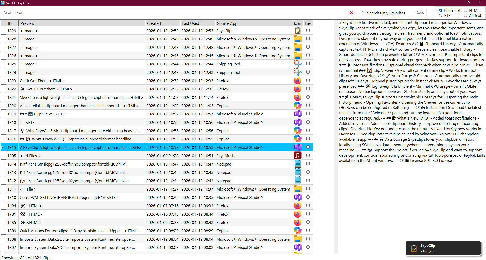

# SkyeClip
A lightweight, fast, and elegant clipboard manager for Windows.



---

## ⚡ Quick Overview
SkyeClip is a modern clipboard manager for Windows that captures everything you copy, 
keeps your history organized, and gives you fast access through a clean tray menu, 
Clip Explorer, and customizable HotKeys. SkyeClip now includes Profiles
and a powerful Rules System that adapts to your workflow automatically.


---

## ✨ Features

### 📋 Clipboard History
- Automatically captures text, HTML, and rich-text content  
- Keeps a clean, searchable history  
- Smart duplicate detection prevents clutter  

### ⭐ Favorites
- Pin important clips for quick access  
- Favorites stay safe during purges  
- HotKey support for instant access  

### 🔔 Toast Notifications
- Optional visual feedback when new clips arrive  
- Clean & minimal 

### 🖼️ Clip Viewer
- View full content of any clip  
- Works from both History and Favorites  

### 🖼️ Scratch Pad
- Temporary space to store clips you’re working with, or even add clips together
- Edit the text directly in the Scratch Pad
- Cut, copy, and paste plain text between the Scratch Pad and other apps

### 🧩 Profiles
- Maintain completely separate clipboard environments (Work, Personal, DEV, etc.)
- Each profile has its own history, favorites, theme, and behavior settings
- Switch profiles instantly from the tray menu
- Move clips between profiles in Clip Explorer

### ⚡ Rules System
Automate SkyeClip based on your context:
- App Rules — trigger actions when specific apps are active
- Location Rules — react to your current network
- Time Rules — schedule behavior changes
- Content Rules — trigger actions based on clipboard content or formats
Rules can switch profiles, block capture, or perform other automated actions.

### 🔍 Clip Explorer
- Browse and search your entire clipboard history in a dedicated window
- Filter by type: Text, RTF, or HTML
- Sort by text, date, favorites, or last used date

### 🧹 Auto‑Purge & Cleanup
- Automatically remove old clips after X days  
- Manual purge option for instant cleanup  
- Favorites are always preserved

### ⚙️ Automatic Backups
- Regular backups of clipboard history
- Manual option
- Flexible schedule
- Auto‑purge of old backups
- Restore support

### ⚙️ Customizable Settings

### 🚀 HotKeys
SkyeClip supports customizable HotKeys for:

- Favorites / Unfavorite the current clip
- Opening the Viewer for the current clip
- Opening the Scratch Pad and pasting the current clip into it

(HotKeys can be configured in Settings.)

### 🛠️ Lightweight & Efficient
- Minimal CPU usage  
- Small SQLite database  
- No background services  
- Starts instantly and stays out of your way  

### 🤖 Smart Automation
SkyeClip can adapt to your workflow automatically:
- Switch to your Work profile when Outlook is active
- Block clipboard capture on public Wi‑Fi
- Switch to your DEV profile during work hours
- Trigger actions based on clipboard content
  
---

## 💡 Why SkyeClip?
Most clipboard managers are either too heavy, too limited, or too intrusive.
SkyeClip focuses on:
- Fidelity — preserves original clipboard formats
- Speed — instant capture and restore
- Simplicity — no clutter, no bloat
- Reliability — predictable behavior, clean UI
- Context‑aware — adapts automatically using Profiles and Rules

---

## 🖥️ System Requirements
- Windows 10 or later
- .NET 10.0 Runtime

---

## 📦 Installation
Download the latest release from the **Releases** page and run the installer.  
No additional dependencies required.

---

## 📝 What’s New (v1.3)

### New Features
- Added a full Rules System that reacts to your context
- Added Profile Support with separate histories, favorites, themes, and settings

### Improvements
- Renamed “Export Clip” to Save To File
- Added Home Page link in About window

### Fixes
- Fixed a rare issue where the Clip Viewer could fail to open until restarting the app.
- Fixed an issue that prevented certain keystrokes in Scratch Pad.

Full changelog available in app.

---

## 💾 Data Storage
SkyeClip stores your clipboard history locally using SQLite.  
No data is sent anywhere — everything stays on your machine.

---

## 📬 Issues
Found a bug or have a feature request?  
[Open an issue on GitHub](https://github.com/YodeSkye/SkyeClip/issues).

---

## ❤️ Support the Project
If you enjoy SkyeClip and want to support development, consider sponsoring or donating via GitHub Sponsors or PayPal. Links available in the About window.

---

## 📄 License
GPL-3.0 License

---

# Using from the repo:

### Requirements
- Visual Studio 2022 or 2026
- .NET 10 SDK

## 📥 Installing SkyeLibrary from a Local `.nupkg` File (included in the repo)

SkyeClip depends on SkyeLibrary, which is included as a .nupkg file in this repository.
To install it (After cloning this repo):

1. Open **Visual Studio**
2. Go to **Tools > NuGet Package Manager > Package Manager Console**
3. Run the following command, replacing the path with wherever you saved the `.nupkg` file:

    ```powershell
    Install-Package SkyeLibrary -Source "C:\Path\To\Your\Package"
    ```

    > 💡 Example: If you saved the `.nupkg` to `Downloads`, use:
    > ```powershell
    > Install-Package SkyeLibrary -Source "C:\Users\YourName\Downloads"
    > ```

Make sure the **Default Project** dropdown (top of the console) is set to the project you want to install into.
